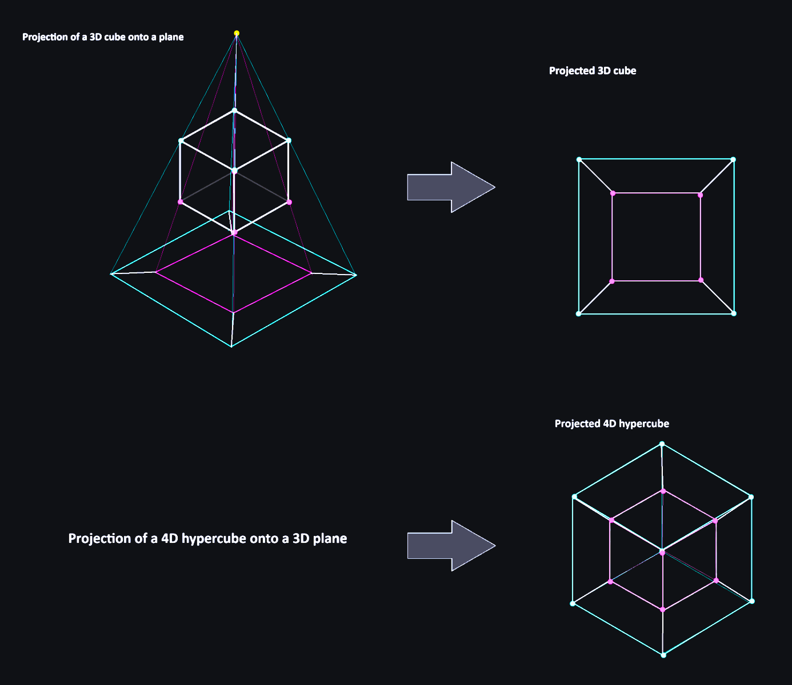

# Tesseract

**4D hypercube render**

---

## Controls

*To rotate 4D hypercube use Q, W, E, R, T, Y, A, S, D, F, G, H keys*

-*Q, W* - rotate around the axis *xw*

-*E, R* - rotate around the axis *yw*

-*T, Y* - rotate around the axis *zw*

-*A, S* - rotate around the axis *xy*

-*D, F* - rotate around the axis *xz*

-*G, H* - rotate around the axis *yz*

## How it works (geometry)

